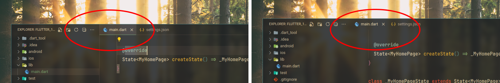
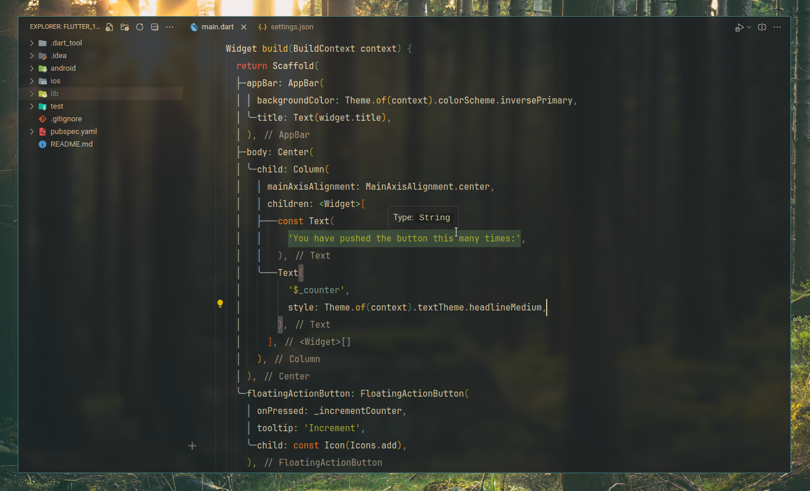
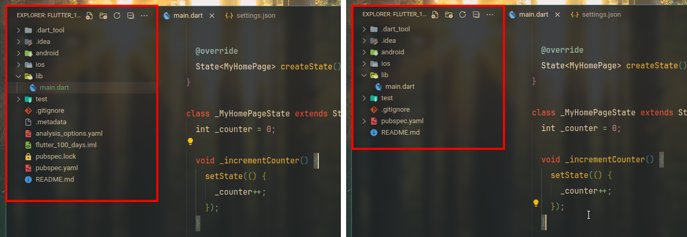

# This is my theme vs code

Before that, I want to clarify the reason why I made this, first, I sometimes use vs code with a certain theme, but in the theme I choose, say using "GruvBox", I don't like the background color of the title bar, menu bar and other defaults from that theme. see the before and after pictures.



Sometimes I like the highlighting colors of a theme but I don't like some of the colors changing out of the main components in my vs code. therefore I tried to change all the element colors in vs code according to my wishes by following the guide [here](https://code.visualstudio.com/docs/getstarted/userinterface), and here's the final result of my theme which is super clean in my eyes, and I'm used to using **key bindings** for my activities in vs code.



> and now I'm free to choose the vs code theme according to my taste every day without worrying about changing the main components of my vs code.

Then I don't like the many rows of files and folders in my file explorer, and actually I rarely open these files because these files are automatically created when I create a new project, let's say I create a flutter project then these files pubspec.lock and others, are automatically generated and I rarely open them. And I use the FileNesting explorer to minimize it all. see the before and after pictures.



this is the sample code:

```json
"explorer.fileNesting.enabled": true,
"explorer.fileNesting.expand": false,
"explorer.fileNesting.patterns": {
   "pubspec.yaml": ".flutter-plugins, .packages, .dart_tool, flutter_100_days.iml, .flutter-plugins-dependencies, .metadata, .packages, pubspec.lock, build.yaml, analysis_options.yaml, all_lint_rules.yaml",
   ".gitignore": ".gitattributes, .gitmodules, .gitmessage, .mailmap, .git-blame*",
   "readme.*": "authors, backers.md, changelog*, citation*, code_of_conduct.md, codeowners, contributing.md, contributors, copying, credits, governance.md, history.md, license*, maintainers, readme*, security.md, sponsors.md",
   "*.dart": "$(capture).g.dart, $(capture).freezed.dart",
   "package.json": "package-lock.json"
},
```
